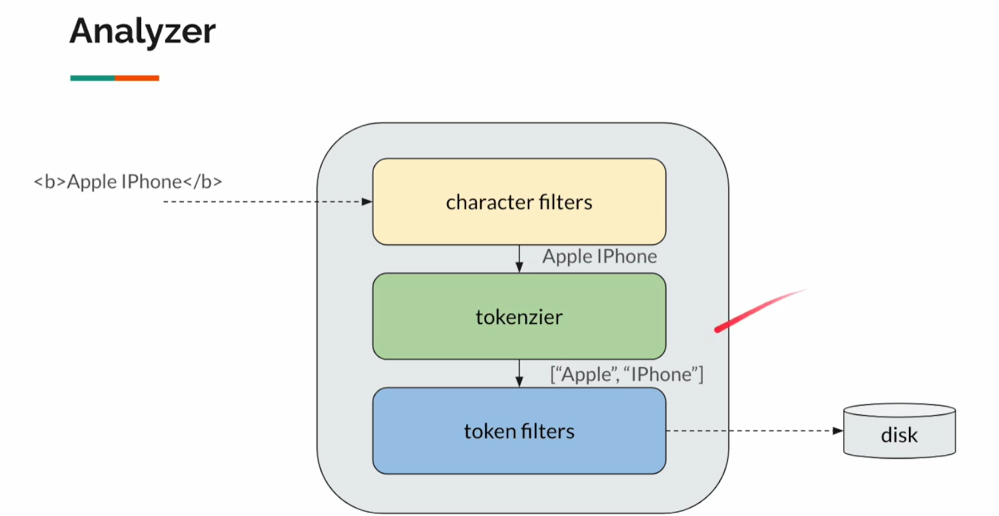
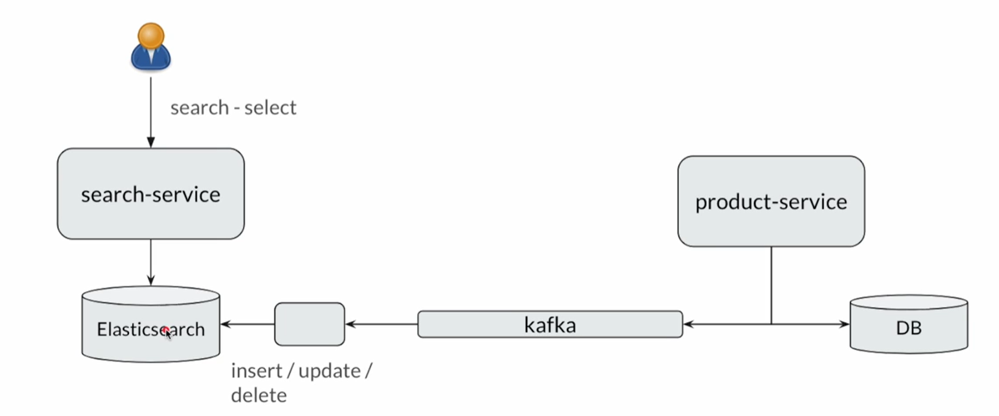

# auto-suggestion-search

When creating a new index "products", elasticsearch will warn us that, we are in single node cluster, so when the server down, we cannot search for anything.

- We need to set up cluster with multiple nodes.

## Search (Simplified)

- Elasticsearch
  - Similar to Java HashMap -> O(1)
- RDBMS
  - Similar to List contains method -> O(N)

## How many primary shards should I create?

- Maxn number of documents per shard is 2.1 Billion
- A shard can handle 25 - 50GB

## Analyzer 

## How Elasticsearch fits in the application architecture

